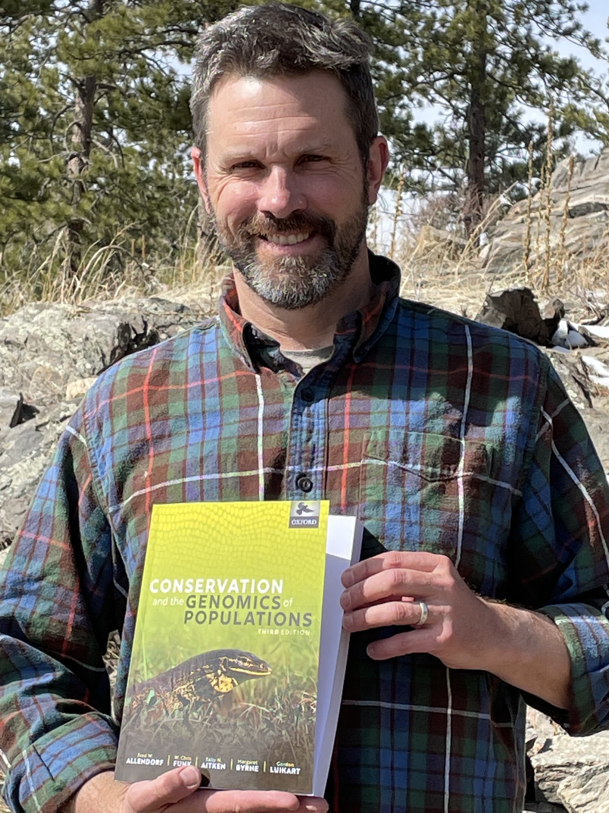

# Who I am and where I came from

I grew up in Oregon where I was lucky enough to live on a forested hill,
which allowed me to spend countless hours playing in the woods.

I studied Biology at two colleges, first [Reed
College](https://www.reed.edu/) and then [Wesleyan
University](https://www.wesleyan.edu/). I ended up gaining expertise in
evolutionary genetics from Dr. Fred Cohan at Wesleyan, and then Dr. Ron
Burton at the Scripps Institute of Oceanography.

My top four things to do when I'm not doing science are:

1.  Trail running
2.  Snorkeling streams
3.  Backpacking
4.  Kayaking and just about anything else outdoors!

Here's a picture of me holding CGP3 at La Hacienda Águila.



# Research Interests

We strive to understand the evolutionary and ecological mechanisms that
generate and maintain biological diversity using population genomics,
experimental manipulations, and field studies. Our goal is to not only
test basic evolutionary and ecological theory, but also directly inform
policy and management decisions that will ultimately determine the fate
of biodiversity.

## Influential papers

A couple of papers that have shown me the power of genetics and genomics
in conservation are @allendorf2010genomics and @slatkin1981estimating.

## The mathematics behind my research

Two equations relevant to my research:

$$
\Delta H = -\frac{1}{2N_e}
$$

$$
F_{ST} = \frac{1}{4N_e m - 1}
$$

## My computing experience

My experience with programming:

-   8th grade: Learned how to program in LOGO in Mr. Delegan's class!
    LOGO was a teaching language that allowed students to write code for
    graphics. For my project, I wrote a program for a short video of a
    Seattle Seahawk NFL football player catching a football and then
    spiking it in the endzone!

-   First year of graduate school at the University of Montana: I wrote
    simulations in Turbopascal vs. 7.0 to estimate Ne using the temporal
    method from simulated populations of known Ne. These simulations
    were published in my first first-authored paper @funk1999small.

-   Rest of graduate school: I wrote lots of Matlab code for Population
    Viability Analyses as part of my dissertation research on the
    effects of dispersal on population dynamics.

-   Island fox project: I ran STACKS and custom scripts written by the
    Hohenlohe lab for a project on the evolutionary processes driving
    patterns of genetic variation in Channel Islands foxes.

-   I have always enjoyed the coding I have done, but have never had
    systematic training in computing or bioinformatics. It totally
    enjoyed this class two years ago, and got a lot out of it, but now
    need a refresher since I'm going to start doing a lot of WGS
    bioinformatics soon.

Some snippets of non-evaluated code:

Unix

```{bash, eval=FALSE}
ls *.Rmd
```

R

```{r, eval=FALSE}
# read in data
pca.data <- read.csv("by_island_PCA_in_loci2001to2243_transposed.csv", header=FALSE)

# take a look
dim(pca.data)
pca.data[1:10,1:10]

# run the pca
pcaout <- prcomp(pca.data, center=T, scale.=F)
summary(pcaout)

# view a quick biplot of PC1 and PC2
plot(pcaout$x[,1],pcaout$x[,2], xlab = "PC 1", ylab = "PC 2")
```

## What I hope to get out of this class

My goal in taking this class is to:

-   Learn a framework for conducting bioinformatic analyses. Although I
    have a solid grasp of pop gen theory, I didn't have any formal
    bioinformatics training before I took this class two years ago, as
    this field was not taught to us when I was a grad student.\
-   I want to have a solid foundation in bioinformatics and
    computational biology so that I can provide my students and postdocs
    with better guidance in their research.
-   And, I would like to be able to lead my own genomics papers now and
    then too! This course will provide with the skills I need to be able
    to do this. I'm planning to lead a monarch butterfly WGS over the
    next couple/few years.
-   Although it will likely take well into this year for my lab to
    collect WGS data (still have to hire the lab manager to do this),
    for now, I can play with the monarch reference genome and WGS data
    from this paper @talla2020monarchgenomics.

# Evaluating some R code

Here's some R code stolen from the WWW to output an exponential plot:

```{r, message=FALSE}

A <- structure(list(Time = c(0, 1, 2, 4, 6, 8, 9, 10, 11, 12, 13, 
14, 15, 16, 18, 19, 20, 21, 22, 24, 25, 26, 27, 28, 29, 30), 
Counts = c(126.6, 101.8, 71.6, 101.6, 68.1, 62.9, 45.5, 41.9, 
46.3, 34.1, 38.2, 41.7, 24.7, 41.5, 36.6, 19.6, 
22.8, 29.6, 23.5, 15.3, 13.4, 26.8, 9.8, 18.8, 25.9, 19.3)), .Names = c("Time", "Counts"), row.names = c(1L, 2L,
3L, 5L, 7L, 9L, 10L, 11L, 12L, 13L, 14L, 15L, 16L, 17L, 19L, 20L, 21L, 22L, 23L, 25L, 26L, 27L, 28L, 29L, 30L,
31L), class = "data.frame")

attach(A)

names(A)

exponential.model <- lm(log(Counts)~ Time)

summary(exponential.model)

timevalues <- seq(0, 30, 0.1)

Counts.exponential2 <- exp(predict(exponential.model,list(Time = timevalues)))

plot(Time, Counts,pch = 16)

lines(timevalues, Counts.exponential2,lwd = 2, col = "red", xlab = "Time (s)", ylab = "Counts")

```

# Citations
